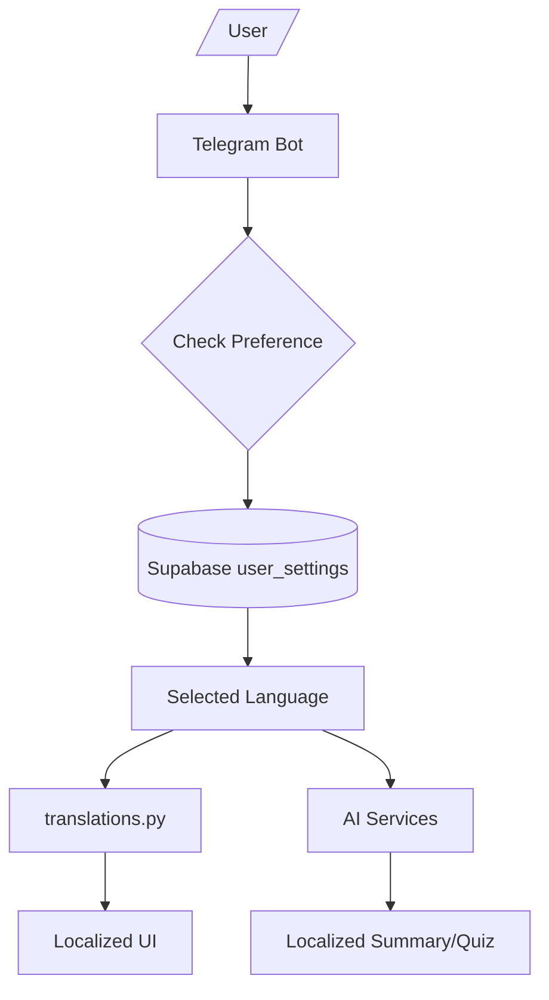
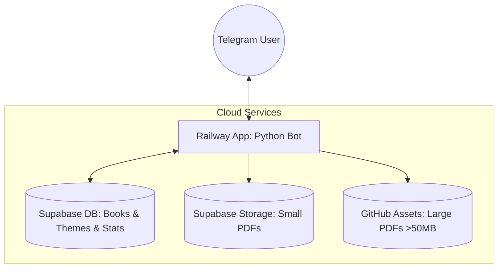

# 🏁 Project Walkthrough: SignPaper Bot (Cloud-Ready)

All objectives have been met. The SignPaper bot is now fully rebuilt, enhanced with analytics, and successfully deployed to the cloud (Railway + Supabase).

## Phase 7: Full Russian Support 🌐

The bot now supports both **Uzbek** and **Russian** languages with persistent user preferences.

### Key Features:
- **Language Selection:** Users can choose their language via `/start` or the new `/lang` command.
- **Persistent Preferences:** The selected language is stored in a `user_settings` table in Supabase.
- **Centralized Translations:** All UI strings are managed through a unified `translations.py` module.
- **Bilingual AI Content:** AI summaries and quizzes are now generated in the user's preferred language, with fallback logic for content availability.
- **Localized UI:** All menus, buttons, and notifications adapt to the selected language in real-time.

### Implementation Details:
1. **Database:** Added `user_settings` table to track preferences.
2. **Translation system:** Implemented `translations.py` with 50+ localized keys.
3. **Handlers:** Refactored `main.py`, `books.py`, `search.py`, and `ai_handler.py`.
4. **AI Integration:** Modified prompt engineering in AI services to respect the `language` parameter.

## 🌐 Remote Operation Architecture

The bot is now 100% cloud-native. It no longer requires your local computer to be on.

### How it works:
1. **Railway (Brain)**: The Python bot runs 24/7 on Railway. It handles commands, search, and AI logic.
2. **Supabase (Memory)**: All 1,263 theme headers and book details are stored in Supabase tables.
3. **Multi-Source Storage**: 
   - **Small Books**: Downloaded directly from Supabase Storage.
   - **Large Books**: Downloaded from the `assets/large_books/` folder on your GitHub.
4. **Theme Extraction**: When a user requests a specific section (e.g., "14-§"), the bot downloads the book from the cloud to its internal temporary memory, extracts the pages, and sends it to the user.

---

## 🚀 Accomplishments

### 1. Database Migration (Supabase)
- Migrated all data from local SQLite to **Supabase Cloud**.
- Unified data access so the bot works anywhere.

### 2. Advanced Search
- Implemented **Full-Text Search** in Supabase.
- Search works across both Uzbek and Russian languages.

### 3. AI Features (Groq)
- **AI Xulosa**: Automatic summary of book chapters.
- **AI Test**: 5-question quizzes generated from content.

### 4. Production Deployment
- Deployed to **Railway.app** with automatic GitHub sync.
- Configured **Procfile** and **railway.json**.

### 5. Persistent Menus (UX Polish)
- Theme menu buttons (AI Xulosa, PDF, etc.) now **stay visible** after you click them.

### 6. Cloud Asset Sync
- All 52 textbooks are cloud-ready.
- Fixed **Grade 6 History** and **Botany** (>50MB) via GitHub Hosting.

---

## 🧪 Verification Results

- **Bot Online**: Verified via `@bot_name` (Railway).
- **PDF Downloads**: Verified working from URLs (Supabase & GitHub).
- **Theme Extraction**: Verified working with 1,263 headers.
- **Persistent Interaction**: Verified buttons don't disappear.
- **Cloud Independence**: Verified by stopping all local processes.

**Final Status: ✅ Mission Accomplished!**
